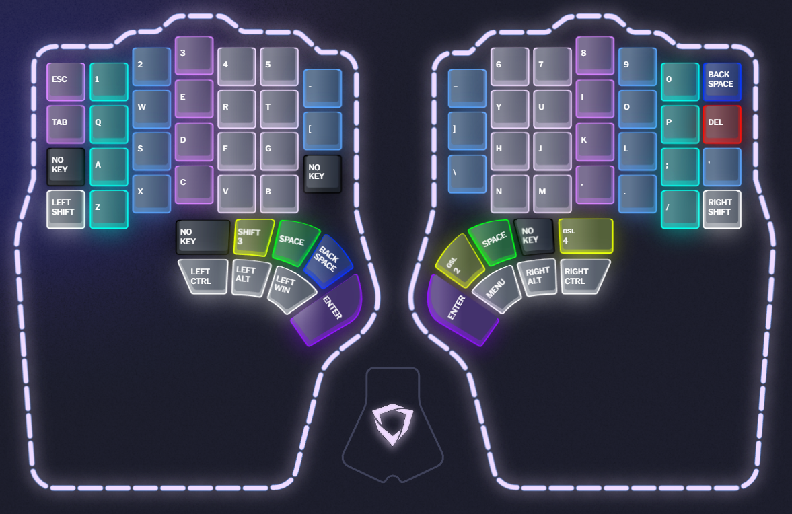
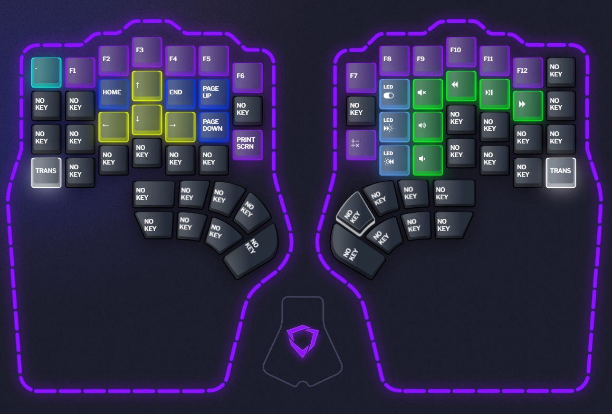
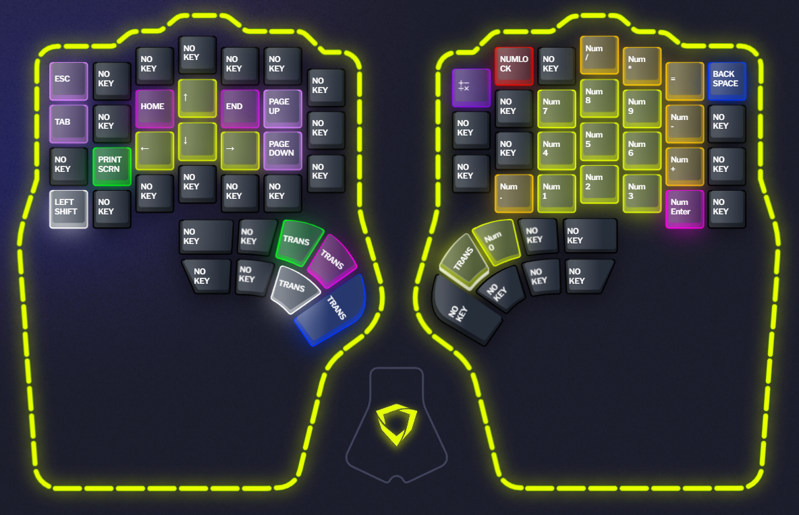
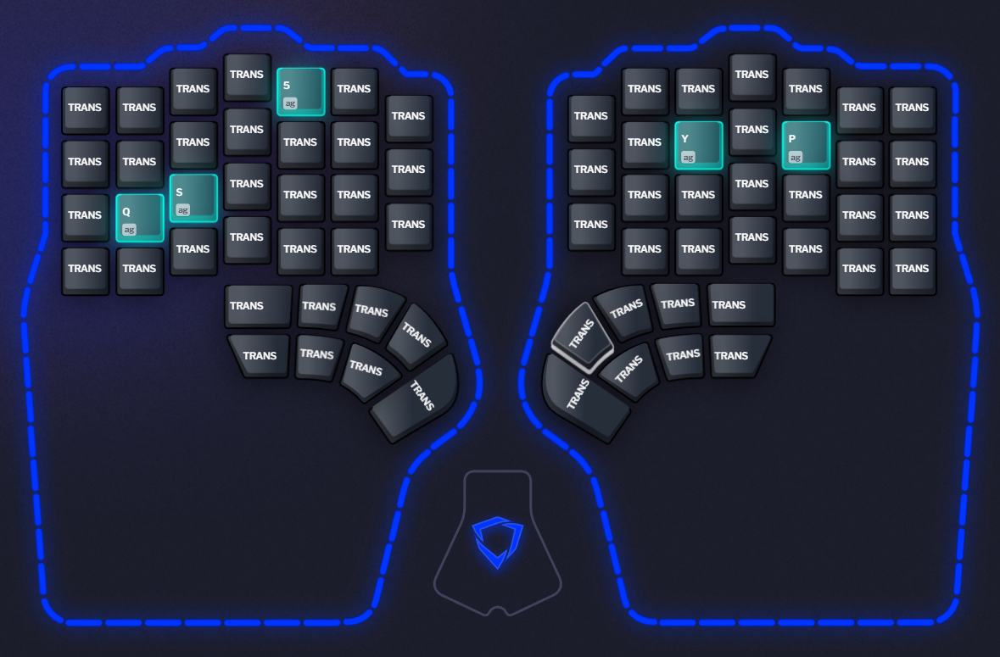
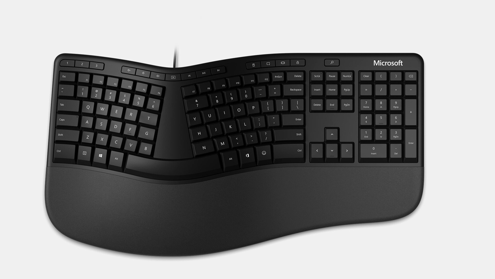

# Dygma Defy configuration

After buying into the Kickstarter on July 1, 2022 and patiently waiting since, the Defy was delivered today, January 13, 2024 and the journey can finally begin. I had earlier already installed the Bazecor software to begin to familiarize myself. I have found the good example of Sebastián Monía who documented his Raise setup in a way I really liked, particularly the need to document not just the configuration itself but also reasoning for it.

See https://github.com/sebasmonia/dotfiles/blob/master/DygmaRaise/README.md for reference.

## General Settings

## Environment
Windows 11 Pro 22H2, running on a desktop computer

### Defy hardware
XTU - Wired, Tenting, Underglow

Gateron G Pro 2.0 Yellow switches

English US Keycaps

### Versions
Firmware: 1.1.0

Bazecor: 1.3.11

## Layers

So far I am only making minimal changes, focusing instead on typing and getting to an at least tolerable typing speed and accuracy.

Layer 4 I've begun to use for experiments and learning the system and layers 5 through to 10 are not used yet.

### Layer 1 - Base
I find that not having a Caps Lock indicator in combination with the new layout is giving me a bit of trouble and since I am not using Caps Lock, it's off the layout.

I also found that I miss having dedicated Ctrl and Alt keys, so I am going to try ditching the dual function Enter keys and the LT1 that came configured as Superkey.

### Layer 2 - Num and Navigation keys

### Layer 3 - Fn, Media and Display keys
The shuffle key does not appear to do anything, so that got removed. The display brightness increase/decrease keys did work, Windows shows the on-screen display, but my hardware seems to not support it, no change on my screens. Maybe that is only a laptop thing. I removed those keys.

### Layer 4 - Experimental

### Layer 5 - 10 - Not used yet

### For reference, this is what I previously used, the Microsoft Ergonomic Keyboard
Of course the Defy is a massive upgrade, but this keyboard got me into the comfortable combination of split layout and tenting.
