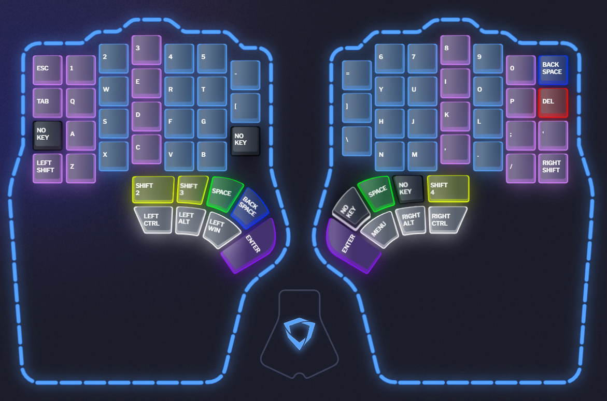

# Dygma Defy configuration

After buying into the Kickstarter on July 1, 2022 and patiently waiting since, the Defy was delivered today, January 13, 2024 and the journey can finally begin. I installed the Bazecor software, currently in version 1.3.9 and am starting to familiarize myself. I have found the good example of Sebastián Monía who documented his Raise setup in a way I really liked, particularly the need to document not just the configuration itself but also reasoning for it.

See https://github.com/sebasmonia/dotfiles/blob/master/DygmaRaise/README.md for reference.

## General Settings

## Layers

So far I am only making minimal changes, focusing instead on typing and getting to an at least tolerable typing speed and accuracy.'

Layer 4 I've begun to use for experiments and learning the system and layers 5 through to 10 are not used yet.

### Layer 1 - Base

### Layer 2 - Num and Navigation keys

### Layer 3 - Fn, Media and Display keys

### Layer 4 - Experimental

### Layer 5 - 10 - Not used yet